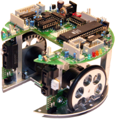
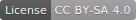

# Willkommen bei c't-Bot und c't-Sim

c't-Bot und c't-Sim gehören zusammen und sind ein Roboterprojekt, das von der Zeitschrift c't Anfang des Jahres 2006 gestartet und in einer Reihe von 16 Artikeln beschrieben wurde.
Das Ziel des c't-Bots war und ist dabei, möglichst Vielen den Zugang zu dem spannenden Thema der Robotik zu eröffnen.
Das Projekt besteht aus zwei Teilen: Dem eigentlichen Roboter c't-Bot und dem dazu passenden Simulator c't-Sim.

Seit Projektstart ist um das Projekt eine Community entstanden, welche das Projekt auch nach dem Erscheinen des letzten c't-Artikels im Jahr 2011 weiterhin pflegt. Derzeit bemüht sich ein Kreis aus Projektbegeisterten um eine Neuorganisation des Projekts.

So sind der Quelltext und die gesamte Dokumentation auf die GitHub-Plattform umgezogen, mit dem Ziel den Projektumfang und das entstandene Wissen auch langfristig zu erhalten und frei zugänglich zu machen.
In Absprache mit dem Heise Verlag, als ursprünglicher Initiator des Projekts, wurde die Projektdokumentation inzwischen größtenteils unter eine CC-BY-SA Lizenz gestellt.

Die zusammengetragenen Inhalte werden derzeit neu aufbereitet und aktualisiert. Darüber hinaus gibt es Pläne und erste Ansätze für eine aktualisierte Version des c't-Bots auf der Basis zeitgemäßer Hard- und Software.

## Community und Support

### Chat/Instant Messenger

- [Matrix](https://de.wikipedia.org/wiki/Matrix_%28Kommunikationsprotokoll%29) (bspw. mit dem Client [Riot.im](https://riot.im), frei, föderal).
  - [Direktzugang zum **ct-Bot-Channel**](https://riot.im/app/#/room/#ctbot:matrix.org) über die Web-App von Riot.im.
  - [Direktzugang zum **News-Channel**](https://riot.im/app/#/room/#ct-Bot-news:matrix.org) über die Web-App von Riot.im.
- [Slack](https://de.wikipedia.org/wiki/Slack_%28Software%29) (proprietär, zentralisiert, aber mehr Funktionen als Riot).
  - [Registrierung zum ct-Bot-Workspace](https://ct-bot-slack.herokuapp.com).
- Hinweise
  - Matrix und Slack sind synchronisiert und zeigen so dieselben Inhalte. Sie können daher nach persönlicher Präferenz gewählt werden.
  - Manchmal kann das Versenden größerer Dateien/Bilder dazu führen, dass im jeweils anderen Protokoll nichts angezeigt wird. Daher besser immer einen Post hinterherschicken, der erwähnt, dass gerade ein Bild o.ä. gepostet wurde.

### Forum

Unter [www.ctbot.de](https://www.ctbot.de) ist das Community-Forum zum c't-Bot und zu verwandten Themen zu finden.
Es besteht bereits seit der Anfangszeit des Projekts und enthält somit nicht nur Support zum Bot sowie aktuelle Diskussionen zur Zukunft des Projekts, sondern auch die spannende Historie des Projekts.

## Dokumentation

### Zukünftige [Projektdokumentation](https://github.com/Nightwalker-87/ct-bot-doku)

Derzeit befindet sich die gesamte Projektdokumentation in der Überarbeitung (siehe auch [Diskussion im Forum](https://www.ctbot.de/viewtopic.php?f=34&t=1219)).
Im Zuge dieser sollen sowohl sämtliche Informationen des ehemaligen Trac-Wikis als auch des Community-Wikis in eine gemeinsame Projektdokumentation integriert werden.
Die Dokumentation steht unter der [CC BY-SA Lizenz](https://creativecommons.org/licenses/by-sa/4.0/). Ausgenommen hiervon sind lediglich die beiden Artikel *c’t-Bot: Programmieren leicht gemacht* und *c’t-Bot: Roboter selbst bauen* aus *c't Hacks / Make, Ausgabe 01/2012*, die unter der [CC BY-NC-SA Lizenz](https://creativecommons.org/licenses/by-nc-sa/4.0/) stehen.

Der aktuelle Stand der Dokumentation ist im Git-Repository [**ct-Bot-doku**](https://github.com/Nightwalker-87/ct-bot-doku) auf GitHub zu finden.
Die Inhalte des ehemaligen Trac-Wikis von Heise sind dort als [Übergangslösung](https://github.com/Nightwalker-87/ct-bot-doku/blob/master/_tmp_trac_wiki_export/readme.md) verfügbar.

### Bisherige Projektdokumentation

- Die [ehemalige, offizielle Projektseite](https://www.heise.de/ct/artikel/c-t-Bot-und-c-t-Sim-284119.html) des c't-Magazins von Heise wird nicht mehr gepflegt und enthält somit zum Teil auch stark veraltete Inhalte.
- Zusammen mit dem Community-Forum ist auch ein Wiki enstanden, das unter [wiki.ctbot.de](https://wiki.ctbot.de) zu finden ist.
Dort finden sich vielen Infos und Dokumentationen zum Projekt, die im Zuge der derzeitigen Neustrukturierung des Projekts jedoch nicht mehr aktiv gepflegt werden.
- Die Liste an [FAQs für c't-Bot & c't-Sim](https://www.heise.de/ct/artikel/FAQ-fuer-c-t-Bot-und-c-t-SIM-291940.html) wird nicht mehr gepflegt und enthält somit zum Teil auch veraltete Inhalte.
- Das [Archiv der ehemaligen Mailingliste](https://www.heise.de/ct/newsletter/archiv/ct-bot-entwickler/) enthält noch den ein oder anderen Schatz an Informationen, die allerdings auch nicht mehr aktuell sein müssen.

## Source Code

Der Quellcode des Projekts ist unter GPL lizensiert und in Git-Repositories auf GitHub verfügbar.
Für den c't-Bot ist er in C geschrieben - egal ob für den hardwarebasierten realen Bot oder den virtuellen Bot im Simulator.
So lassen sich komplexe Verhaltensmuster für den Bot zunächst am PC testen.
Der in Java geschriebene Simulator c't-Sim kommuniziert mit mehreren virtuellen Robotern, gaukelt ihnen eine Umgebung vor und liefert Sensorwerte zurück.

Das Software-Framework des c’t-Bot erfüllt sehr unterschiedliche Anforderungen:

- Die Programmierung des Roboters soll möglichst einfach sein, indem von der Komplexität der typischen Mikrocontroller-Programmierung wie Interrupts, I/O-Ports, Timer, PID-Regler abstrahiert wird.
- Alle Sensorwerte stehen als globale Variablen zur Verfügung, die automatisch aktualisiert werden. Einfache Funktionen ermöglichen den Zugriff auf die Aktuatoren.
- Der Source Code ist plattformunabhängig, sodass er sowohl im Simulator auf einem PC als auch dem realen Bot läuft, ohne dass man ihn manuell anpassen muss.
- Einmal entwickelte Unterprogramme (im Framework *Verhalten* genannt), von ganz rudimentären wie `bot_turn()` bis zu komplexen wie `bot_solve_maze()`, lassen sich weiterverwenden und in andere Routinen einbauen.

### Offizielle Code-Repositories

- [**ct-Bot**](https://github.com/tsandmann/ct-bot) Code-Repository auf GitHub.
- [**ct-Sim**](https://github.com/tsandmann/ct-sim) Code-Repository auf GitHub.

### Weitere Repositories

- [ct-bot-hw](https://github.com/tsandmann/ct-bot-hw) ist das Repository für das c't-Bot Hardware-Design.
  - Im Ordner [v1](https://github.com/tsandmann/ct-bot-hw/tree/master/v1) finden sich  die Design-Dateien des originalen ct-Bots und die gehörigen Datenblätter.
  - Im Ordner [v2](https://github.com/tsandmann/ct-bot-hw/tree/master/v2) ist die Entwicklung einer neuen Hardware-Revision des ct-Bots zu finden, die derzeit in Planung ist.
- [ctbot-atmega](https://github.com/tsandmann/ctbot-atmega) enthält eine vollständige Neuentwicklung in C++ einer reduzierten Basis-Firmware für die Grundfunktionalität eines realen ct-Bots. Nähere Informationen finden sich in der [Readme-Datei](https://github.com/tsandmann/ctbot-atmega/blob/master/README.md).
- [ctbot-teensy](https://github.com/tsandmann/ctbot-teensy) enthält eine vollständige Neuentwicklung des Frameworks in C++ für einen realen Bot, der mit einem Teensy 35 oder Teensy 36 Mikrocontroller ausgestattet ist. Nähere Informationen finden sich in der [Readme-Datei](https://github.com/tsandmann/ctbot-teensy/blob/master/README.md).

Bildquelle & -Lizenz: *c’t-Bot ohne Kabel* von Peter Recktenwald, CC BY-SA 3.0
