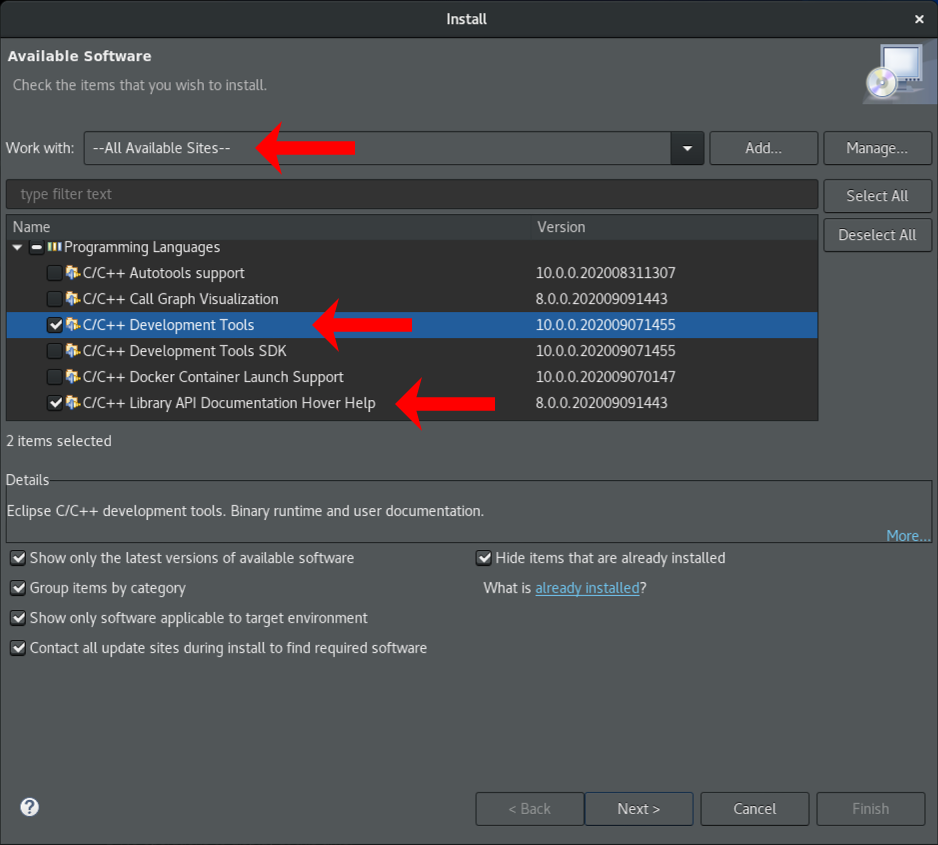

# Installationsanleitung für Eclipse

Die folgende Anleitung beschreibt die Installation von **Eclipse 2021‑09** inkl. der erforderlichen **Plugins**.

```warning
Eclipse 2021‑09 ist die aktuell empfohlene Version, einige ältere Versionen (4.x zurück bis Luna 4.4, 3.x bis Galileo 3.5) funktionieren grunsätzlich auch, noch Ältere hingegen nicht einwandfrei. Insbesondere zum Entwickeln des Bot-Steuercodes in C sollte man die neueste Eclipse Version verwenden, weil gerade das CDT Plugin erhebliche Verbesserungen erfahren hat.
```

## Eclipse Basisinstallation

Für Experimente am Code des Simulators und des Bots bietet sich die Entwicklungsumgebung [Eclipse](https://de.wikipedia.org/wiki/Eclipse_(IDE)) an, da sie einerseits Java unterstützt für die Weiterentwicklung des ct-Sim und andererseits C für die Entwicklung des ct-Bot-Steuercodes. Eclipse selbst ist in Java geschrieben und für alle gängigen Rechnerplattformen verfügbar. [Warum Eclipse und keine andere IDE?](https://www.heise.de/ct/artikel/FAQ-fuer-c-t-Bot-und-c-t-SIM-291940.html?seite=3)

**Zur Installation** lädt man den Eclipse-Installer unter [Eclipse Downloads](https://www.eclipse.org/downloads/) für seine Plattform herunter, entpackt (je nach Plattform) und startet ihn. Im Installer wählt man __*Eclipse IDE for Java Developers*__ zur Installation aus und startet die Installation:


Beim anschließenden ersten Start von Eclipse wird ein Workspace angelegt, der Pfad lässt sich an die eigenen Bedürfnisse anpassen. Im nächsten Schritt wird die Unterstüzung für die Programmiersprachen C und C++ mit dem Plugin __*CDT*__ nachgerüstet.

Unter macOS kann der Eclipse-Installer alternativ auch mit Homebrew installiert werden:
```shell
brew tap homebrew/cask
brew install eclipse-installer
open /usr/local/Caskroom/eclipse-installer/*/Eclipse\ Installer.app
```

## CDT Plugininstallation

Das Plugin CDT (C/C++ Development Toolkit) rüstet in Eclipse die Unterstützung für die Entwicklung in C und C++ nach. Die Installation nimmt man über den in Eclipse integrierten Update-Mechanismus wie folgt vor:

1. Aktualisieren der Paket-Quellen über `Help` -> `Check for Updates`:

    

1. Plugin Installation starten über `Help` -> `Install new Sofware...`:

    

1. C/C++ Development Tools installieren: oben `--All Available Sites--` auswählen und unter `Programming Languages` dann `C/C++ Development Tools` und `C/C++ Library API Documentation Hover Help` markieren:

    

    Anschließend den Assistenten mit `Next >` und `Finish` durchklicken und Eclipse neustarten.

1. Die richtige Java Version auswählen unter `Window` (unter macOS `Eclipse`) -> `Preferences` ->` Java` -> `Installed JREs`:

    

    1. Unter `Search...` den Pfad `/usr/lib/jvm/` (Linux) oder `C:\Program Files\AdoptOpenJDK` (Windows) öffnen:

       

    1. Dann `java-1.8.0-openjdk` oder `adoptopenjdk-8-hotspot-amd64` oder `jdk-8.0.X.Y-hotspot` markieren und mit `Apply` speichern:

       

    1. Danach unter `Java` -> `Compiler` Version `1.8` bei `Compiler compliance level` auswählen:

       

1. Zum Abschluss noch auf die Perspektive C/C++ wechseln: `Window` -> `Perspective` -> `Open Perspective` -> `Other...`:

    

    1. Dort `C/C++`auswählen:

        

    1. Anschließend noch den *C/C++ Projects Viewer* öffnen: `Window` -> `Show View` -> `C/C++ Projects`:

        


## Git-Zugriff

Zum Import des Codes aus dem [Git-Repository](https://github.com/tsandmann/ct-bot) in Eclipse siehe [Zugriff auf die Git-Repositories mit Eclipse](../repository/1_git-eclipse.md).

---

<a href="https://creativecommons.org/licenses/by-sa/4.0/" target="_blank"></a><br>
Autor: <a href="https://github.com/tsandmann" target="_blank" style="color:#3c454e;">Timo Sandmann</a> \| Stand: 08.10.2021
