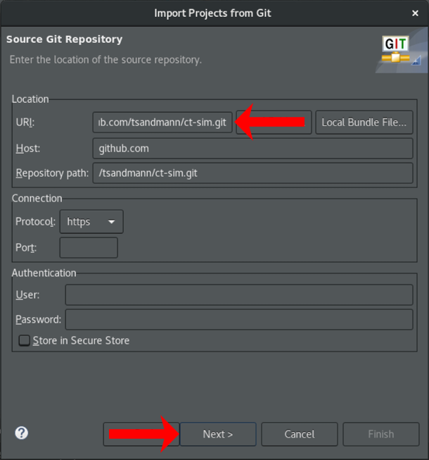

# Zugriff auf die Git-Repositories mit Eclipse

## Import des Codes

Die Quelltexte von ct-Bot und ct-Sim sind auf [GitHub](https://github.com) verfügbar. Sie lassen sich wie folgt in Eclipse importieren: 

1. Unter `File` -> `Import` die Option `Git` -> `Projects from Git` auswählen:

    

1. Dort `Clone URI` verwenden:

    

1. Unter `Location` -> `URI:` für den ct-Bot Code `https://github.com/tsandmann/ct-bot.git` oder für den ct-Sim Code `https://github.com/tsandmann/ct-sim.git` eintragen:

    

1. Den Assistenten mit `Next >` und `Finish` beenden.

```note
Die Schritte 1 bis 4 jeweils für ct-Bot und ct-Sim ausführen.
```

Beim Auschecken von ct-Bot müssen ggf. noch die korrekten Pfade zu Hilfswerkzeugen eingestellt werden:
 1. Das richtige Target einstellen: Rechtsklick auf das Projekt -> `Build Configurations` -> `Set Active` -> `Debug-Linux_Mac` (Linux oder macOS) oder `Debug-W32` (Windows) auswählen. 

  1. Das ct-Bot-Projekt mit `Project` -> `Clean...` für den Simulator compilieren und prüfen, ob dann im Projektverzeichnis die Datei `Debug-Linux_Mac/ct-Bot` (Linux / macOS) bzw. `Debug-W32\ct-Bot.exe` (Windows) erstellt wurde.
      * Falls ja, funktionieren die Einstellungen.
      * Falls nein, die Schritte zur Konfiguration aus der [Installationsanleitung](../installation/1_installation-allgemein.html#ii-tools-für-simulierte-bots-x86-installieren) durchführen (*PATH-Einträge in Eclipse ergänzen*).

        ```tip
        Bei Fehlern gibt das Teilfenster „Console“ in Eclipse manchmal Hinweise, was fehlt.
        ```
        ```warning
        Vorsicht unter Windows: Wenn im System bereits ein anderes C-Compiler-Paket installiert ist – etwa von Borland – kann es sein, dass dessen Compiler und make-Äquivalent gemäß Reihenfolge im Path bevorzugt werden. Das ct-Bot-Projekt geht davon aus, mit make und dem gcc der MinGW-Installation kompiliert zu werden.
        ```

Zum Testen im Simulator siehe [ct-Sim inkl. virtueller Bots starten](../installation/1_installation-allgemein.md#ct-sim-und-virtuelle-bots-aus-eclipse-starten).

```tip
Per Rechtsklick auf das Projekt und `Team` -> `Pull...` kann der Quelltext jederzeit wieder vom offiziellen Git-Repository heruntergeladen und auf den neuesten Stand gebracht werden.
```

## Aufbau der Repositories

Es gibt für ct-Bot und ct-Sim jeweils zwei wesentliche *Zweige* (Branches) in den offiziellen Repositories: *master* und *develop*.

1. Branch [master](https://github.com/tsandmann/ct-bot/tree/master): Hier liegt lauffähiger Code, der aber vielleicht nicht das Cutting Edge der Entwicklung enthält.
1. Branch [develop](https://github.com/tsandmann/ct-bot/tree/develop): Cutting-edge Code, keine Garantie für gar nix. Eventuell gibt es hier auch mal Änderungen, die nicht vollständig getestet sind oder bald wieder verschwinden.
 
```note
Falls eigener Bot-Steuercode entwickelt werden soll, ist der stabilere Code aus dem Branch `master` richtig. Falls Weiterentwicklungen geschrieben werden sollen, empfiehlt sich der aktuellere Enwicklerbranch `develop`.
```

```tip
Falls man zu einem späteren Zeitpunkt den Branch wechseln möchte, kann man in Eclipse nach Rechtsklick auf das Projekt den Menüpunkt `Replace With` -> `Branch, Tag, or Reference...` wählen, dort finden sich unter `Remote Tracking` alle verfügbaren Branches.

Alternativ können in Eclipse auch zwei Projekte angelegt werden, um das eine mit dem Branch *master* und das andere mit dem Branch *develop* herunterzuladen, hierzu muss man den Projekten lediglich unterschiedliche Projektnamen beim Import geben. Leerzeichen im Projektnamen sollten grundsätzlich vermieden werden.
```

## Zurück zu älteren Code-Versionen

Möchte man auf eine ältere Version des Codes aus dem offiziellen Git-Repository wechseln, so kann man das wie folgt tun:

1. Rechtsklick auf das Projekt -> `Replace With` -> `Branch, Tag, or Reference...` -> unter `Tags` findet man die alten Release-Versionen.
1. Alternativ kann man über `Replace With` -> `Commits...` einzelne Commits rückgängig machen.
1. Nun wähl man die gewünschte Version aus und bestätigt mit OK. Achtung, vorhandene eigene Änderungen gehen dabei verloren!

```tip
Die Funktion `Compare With` lässt sich analog benutzen, um Änderungen nachzuverfolgen.
```

---

<a href="https://creativecommons.org/licenses/by-sa/4.0/" target="_blank"></a><br>
Autor: <a href="https://github.com/tsandmann" target="_blank" style="color:#3c454e;">Timo Sandmann</a> \| Stand: 20.12.2020
