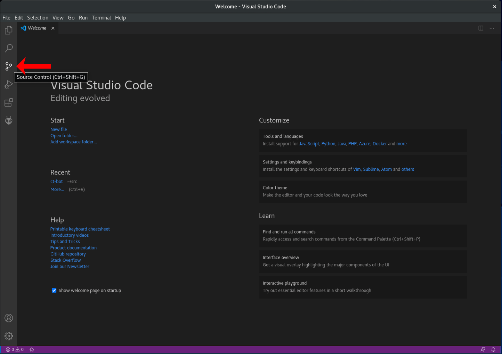
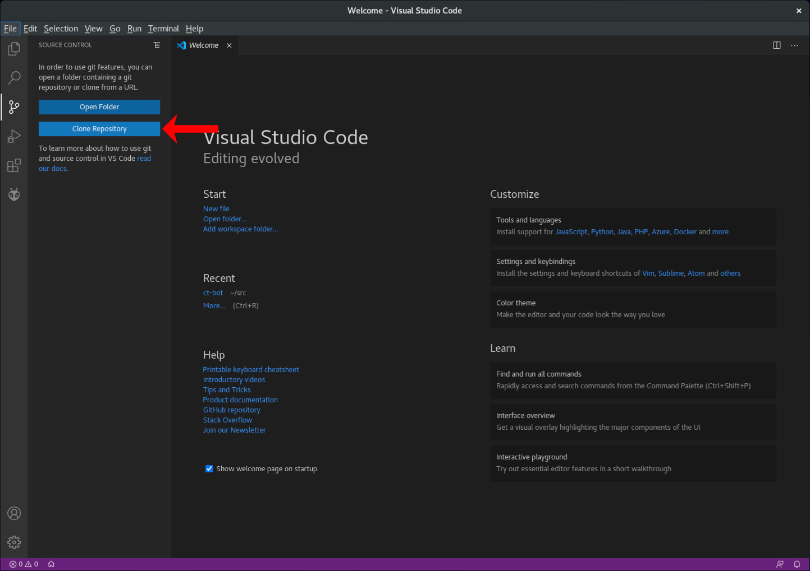
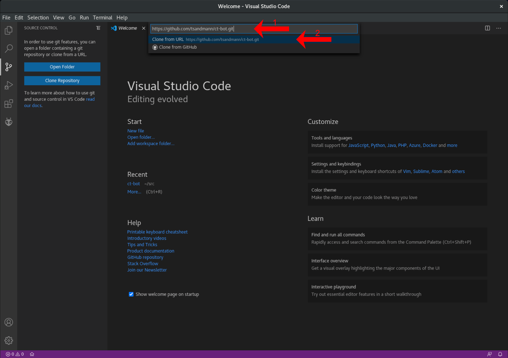
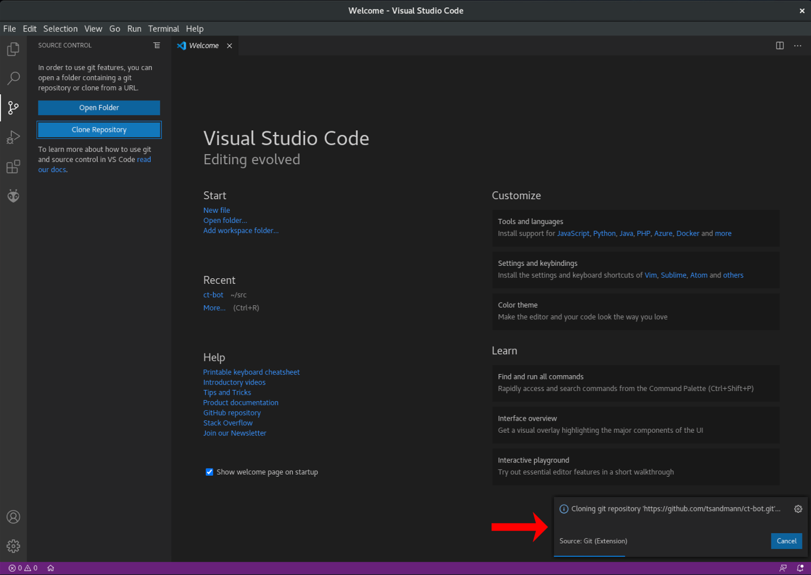
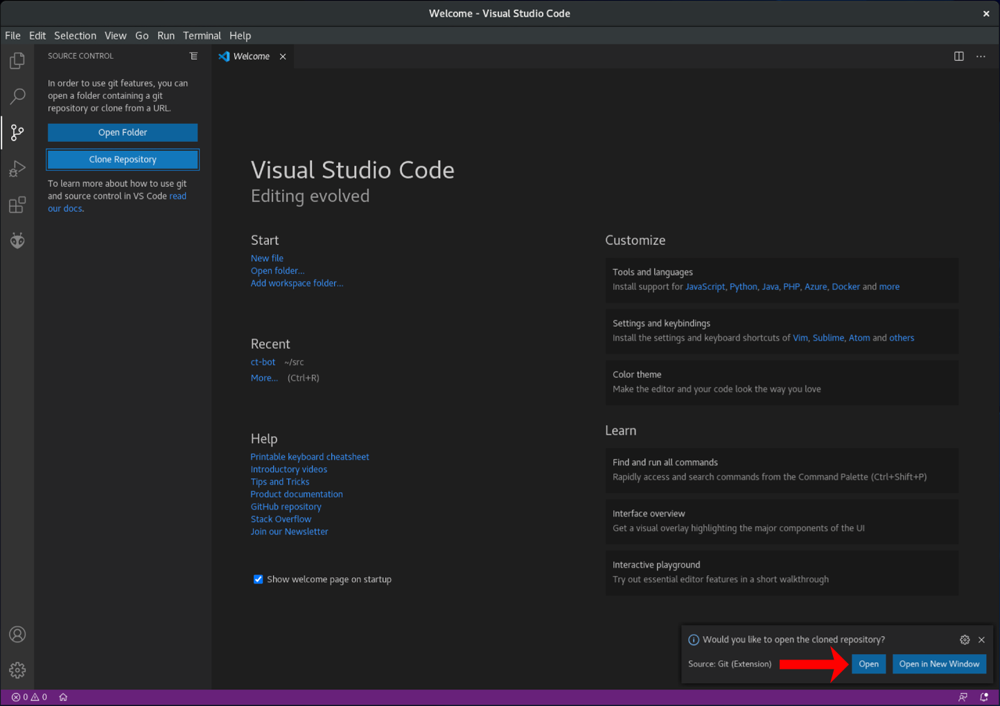

# Zugriff auf die Git-Repositories mit Visual Studio Code

## Import des Codes

Die Quelltexte von ct-Bot und ct-Sim sind auf [GitHub](https://github.com) verfügbar. Sie lassen sich wie folgt in Visual Studio Code importieren: 


1. In der Seitenleiste links `Source Control` (Strg + Shift + G) auswählen:

    

1. Dort `Clone Repository` verwenden:

    

1. Als URL für den ct-Bot Code `https://github.com/tsandmann/ct-bot.git` oder für den ct-Sim Code `https://github.com/tsandmann/ct-sim.git` angeben und mit Enter bestätigen:

    

1. Nachdem das Repository heruntergeladen und ausgecheckt wurde...

    

1. ... lässt es sich das Projekt mit einem Klick auf `Open` direkt öffnen:

    

## Aufbau der Repositories

Es gibt für ct-Bot und ct-Sim jeweils zwei wesentliche *Zweige* (Branches) in den offiziellen Repositories: *master* und *develop*.

1. Branch [master](https://github.com/tsandmann/ct-bot/tree/master): Hier liegt lauffähiger Code, der aber vielleicht nicht das Cutting Edge der Entwicklung enthält.
1. Branch [develop](https://github.com/tsandmann/ct-bot/tree/develop): Cutting-edge Code, keine Garantie für gar nix. Eventuell gibt es hier auch mal Änderungen, die nicht vollständig getestet sind oder bald wieder verschwinden.

```note
Falls eigener Bot-Steuercode entwickelt werden soll, ist der stabilere Code aus dem Branch `master` richtig. Falls Weiterentwicklungen geschrieben werden sollen, empfiehlt sich der aktuellere Enwicklerbranch `develop`.
```

## Code aktualisieren

In der `Source Control`-Ansicht (Strg + Shift + G) oben rechts unter `More Actions...` (`...`) kann der Quelltext jederzeit über den Menüpunkt `Pull` vom offiziellen Git-Repository heruntergeladen und auf den neuesten Stand gebracht werden.

## Branch wechseln

Um den Branch zu wechseln, wählt man in der `Source Control`-Ansicht (Strg + Shift + G) oben rechts unter `More Actions...` (`...`) den Menüpunkt `Checkout to...` aus und selektiert anschließend den gewünschten Branch.

---

<a href="https://creativecommons.org/licenses/by-sa/4.0/" target="_blank"></a><br>
Autor: <a href="https://github.com/tsandmann" target="_blank" style="color:#3c454e;">Timo Sandmann</a> \| Stand: 20.12.2020
