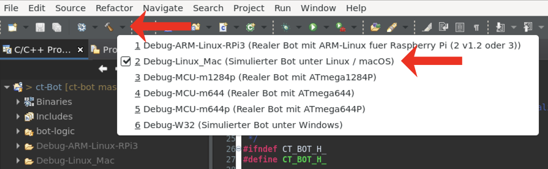
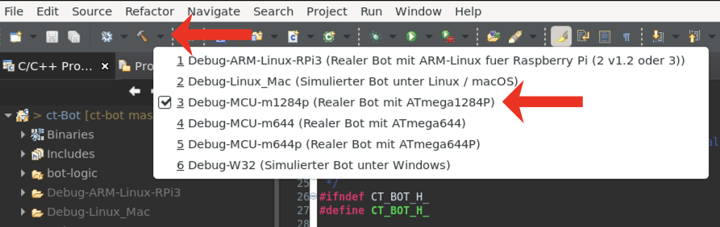
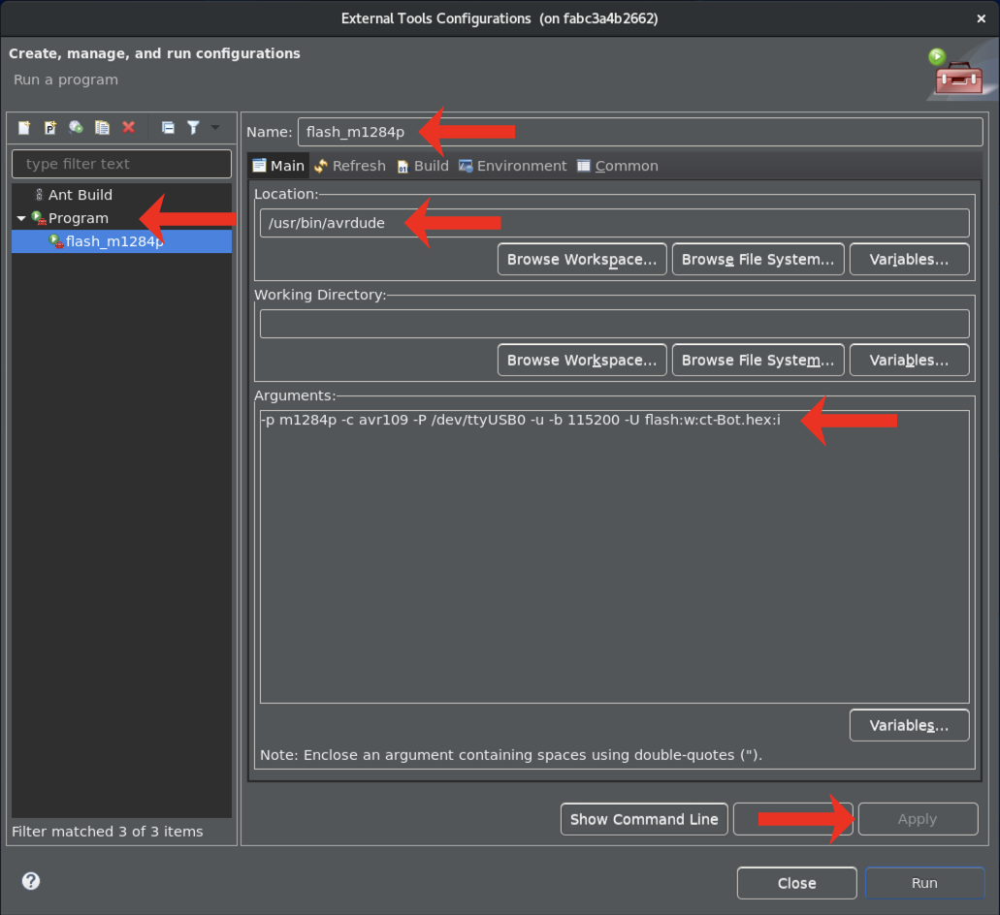

# Verwendung von Eclipse

## Code compilieren

### Code für den Simulator compilieren

1. Als Target `Debug-Linux_Mac` (Linux/macOS) oder `Debug-W32` (Windows) auswählen:

    

1. `Project` -> `Clean...`: `ct-Bot` auswählen und `Clean` klicken.
1. Ergebnis der Compilierung im Reiter `Console` (unten) überprüfen.

### Code für einen realen ct-Bot compilieren

1. Als Target `Debug-MCU-m1284p` auswählen:

    

1. `Project` -> `Clean...`: `ct-Bot` auswählen und `Clean` klicken.
1. Ergebnis der Compilierung im Reiter `Console` (unten) überprüfen.

```tip
Schritt 2. (Clean) ist jeweils nur erforderlich, um das Projekt einmal komplett neu zu bauen. Anschließend wird das Projekt beim Speichern der Sourcecode-Datei automatisch gebaut.
```

## Nützliche Einstellungen

Die folgenden Einstellungen finden sich unter `Window` ->  `Preferences`:

1. `General` -> `Editors` -> `Text Editors` -> `Spelling`: `Enable spell checking` **de**aktivieren
1. `General` -> `Perspectives` -> `Available perspectives:` -> `C/C++`: `Make Default` klicken
1. `C/C++` -> `Code Analysis`: alle **de**aktivieren
1. `C/C++` -> `Build` -> `Console`: `Limit console output (number of lines)`: **5000**
1. `C/C++` -> `Editor` -> `Folding`:
    1. `Enable folding of preprocessor branches (#if/#endif)` **aktivieren**
    1. `Enable folding of control flow statements (if/else/, do/while, for, switch)` **aktivieren**
    1. `Initially fold these region types`:
        1. `Comments` **aktivieren**
        1. `Inactive Preprocessor Branches` **aktivieren**
1. `C/C++` -> `Indexer`: `Build configuration for the indexer`: `Use active build configuration`
1. `Apply and Close` klicken

## Firmware flashen

Der Aufruf von avrdude zum Flashen der Firmware lässt sich in Eclipse als "External Tool" einbinden, dann wird per Mausklick die hex-Datei des aktiven Projekts geflasht. Die Argumente für den avrdude-Aufruf muss man entsprechend anpassen (siehe [Übertragen der Firmware](3_usage-avrdude.md)), ebenso den Pfad, unter dem avrdude installiert ist.

Der Einstell-Dialog für External Tools ist über `Run` -> `External Tools` -> `External Tools Configuration...` gefolgt von einem Doppelklick auf `Program` zu erreichen:

   

Beispiel-Einstellung für einen ct-Bot mit ATmega1284P mit installiertem Bootloader und der Verwendung eines USB-2-Bot-Adapters zum Flashen unter Linux:

1. `Name`: `flash_m1284p` (kann beliebig vergeben werden)
1. `Location`: `/usr/bin/avrdude` (der Pfad lässt sich mittels `locate avrdude` ausfindig machen)
1. `Arguments`: `-p m1284p -c avr109 -P /dev/ttyUSB0 -u -b 115200 -U flash:w:ct-Bot.hex:i`
1. Wechsel auf den Reiter `Build`, um `The project containing the selected resource` auszuwählen
1. Wechsel auf den Reiter `Common`, um unter `Display in favorites menu` die Checkbox `External Tools` zu **aktivieren**
1. `Apply` klicken zum Abschließen der Konfiguration

Gestartet wird der Flashvorgang dann über die Menüleiste, in der sich ein grüner Button mit weißem Pfeil und kleinem roten Werkeugkasten (`External Tools`) befindet. Dort wählt man die Konfiguration mit dem vergebenen Namen (`flash_m1284p` in diesem Beispiel) aus. Unten rechts in Eclipse sollte dann "Launching flash_m1284p" mit einer Prozentanzeige erscheinen. Die Eclipse-Konsole (Reiter `Console` unten) gibt ggf. auftretende Fehler aus.

---

<a href="https://creativecommons.org/licenses/by-sa/4.0/" target="_blank"></a><br>
Autoren: <a href="https://github.com/r4dh4l" target="_blank" style="color:#3c454e;">anonybot</a>, <a href="https://github.com/tsandmann" target="_blank" style="color:#3c454e;">Timo Sandmann</a> \| Stand: 26.12.2020
