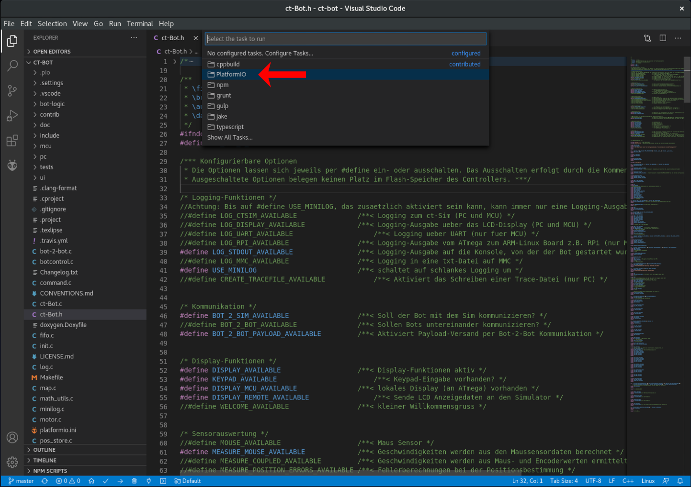
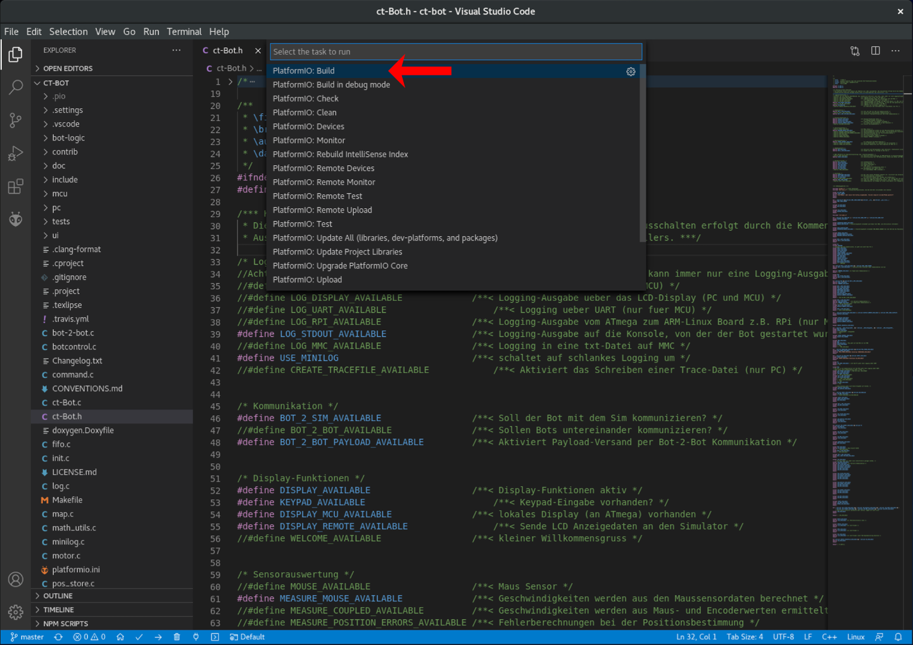
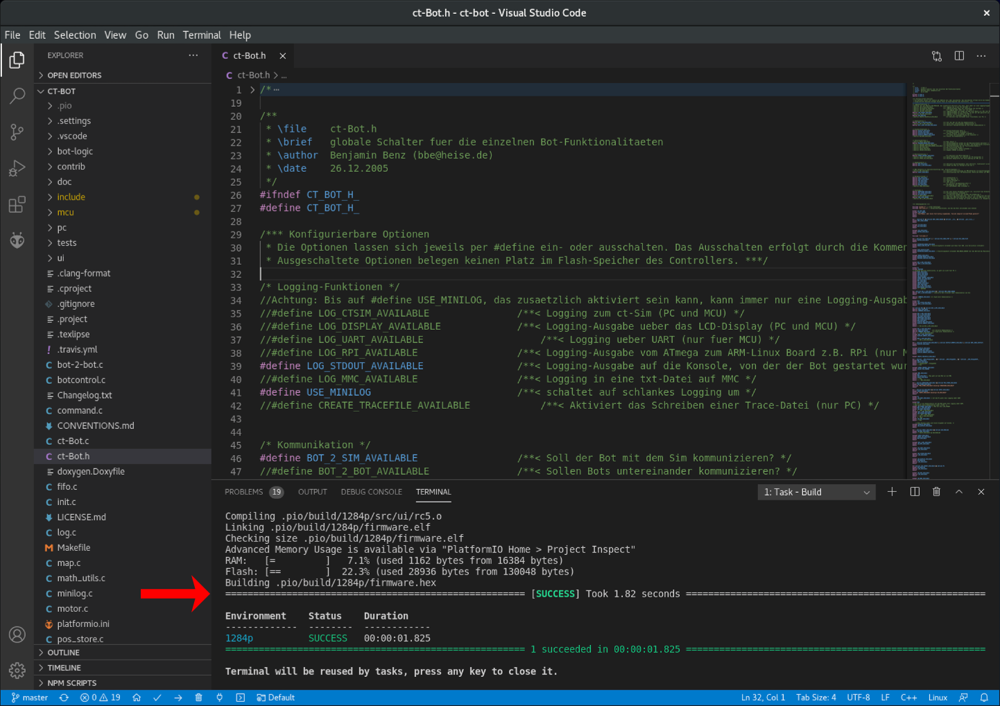
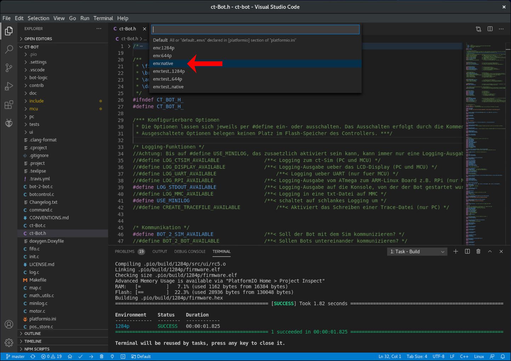
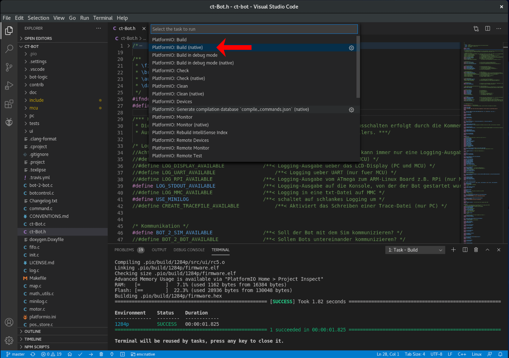
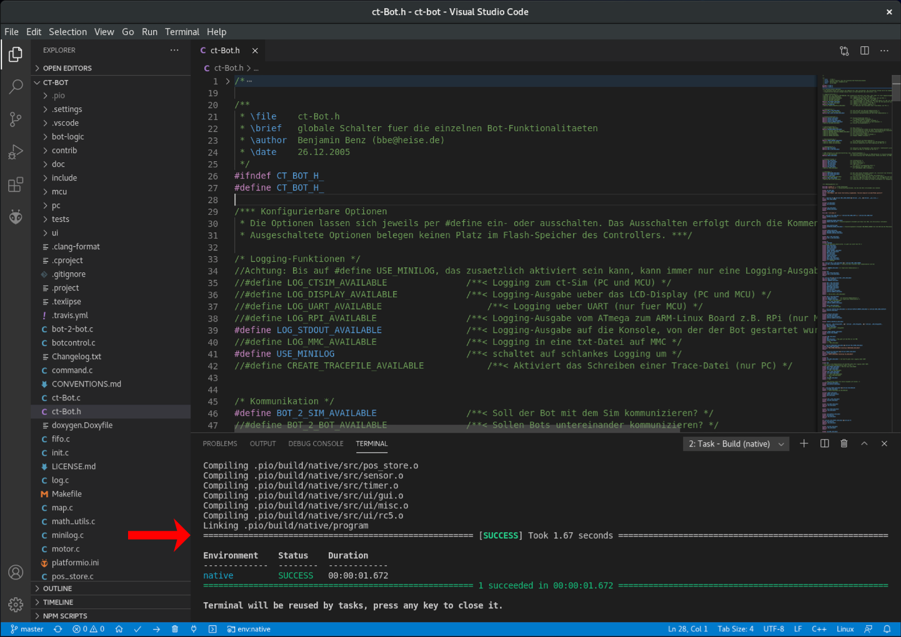

# Verwendung von Visual Studio Code

## Code compilieren

1. Mit Strg + Alt + T die Taskauswahl öffnen und `PlatformIO` wählen:

    

### Für MCU

1. `PlatformIO: Build` baut die Standardkonfiguration (ATmega 1284P):

    

1. Das Ergebnis ist anschließend in der Konsolenausgabe unten zu sehen:

    

### Für PC

1. Zuerst die Projekt-Umgebung auf `native` umstellen, dazu unten in der Statusleiste auf `Switch PlatformIO Project Environment` klicken und in der Auswahlliste `env:native` auswählen:

    

1. Dann mit Strg + Alt + T die Taskauswahl öffnen und `PlatformIO` -> `PlatformIO: Build (native)` wählen:

    

1. Das Ergebnis ist anschließend in der Konsolenausgabe unten zu sehen:

    

```tip
Um den simulierten Bot zu starten, auf einer Konsole ins Verzeichnis des ct-Bot-Projekts wechseln und `.pio/build/native/program` aufrufen.
```

## Firmware flashen

```danger
ToDo: Beschreibung der Programmieradapter-Einstellung und des Flashvorgangs
```

## Remote-Entwicklung

### SSH

```danger
ToDo: Beschreibung der Möglichkeiten zur Entwicklung auf einem Remote-System über SSH.
```

### WSL

```danger
ToDo: Beschreibung der Möglichkeiten zur Entwicklung unter Windows mit WSL.
```

---

<a href="https://creativecommons.org/licenses/by-sa/4.0/" target="_blank"></a><br>
Autor: <a href="https://github.com/tsandmann" target="_blank" style="color:#3c454e;">Timo Sandmann</a> \| Stand: 20.12.2020
