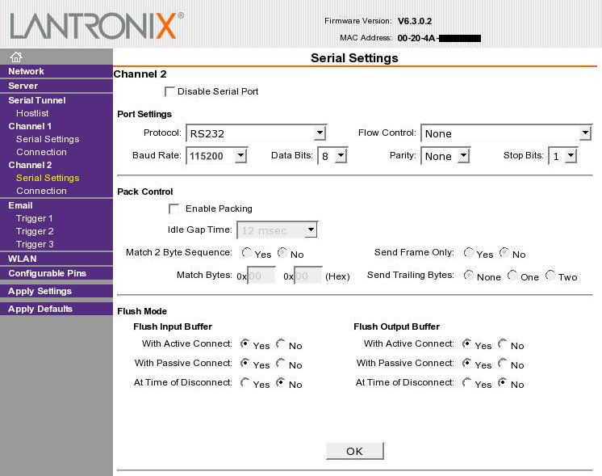

# Übertragen der Firmware auf den ct-Bot

Damit ein fertig compiliertes .hex-File vom PC über einen Programmieradapter auf den Mikrocontroller kommt, braucht man neben dem Adapter eine passende Programmiersoftware. Die Software **<a href="https://savannah.nongnu.org/projects/avrdude/" target="_blank">avrdude</a>** wird im Rahmen der Toolchain mit installiert, siehe [Installationsanleitung](../installation/1_installation-allgemein.md#iii-tools-für-reale-bots-atmega-installieren).

## Auswahl möglicher Programmieradapter für den ct-Bot

Ein Programmieradapter verbindet den ISP-Port des Roboters mit dem PC. Über ihn kann man die Fuse-Bits setzen und die Firmware übertragen, auch wenn der Chip noch völlig leer ist.

```tip
Das nachfolgend aufgeführte Kommandozeilen-Argument (`-p m1284p`) gilt jeweils für den im ct-Bot Projekt empfohlenen Mikrocontroller *ATmega1284P*. Wer einen älteren Controller einsetzt (*ATmega644(P)* oder *ATmega32*), findet im Abschnitt [unten](#hinweise-für-besitzer-eines-atmega32-oder-atmega644p-mikrocontrollers) die dafür nötigen Parameter.
```

```tip
Werden die fertigen Container-Images zur Entwicklung eingesetzt, muss der Pfad zum Programmieradapter in den Container gemounted werden, siehe hierzu [Fertige Container-Images zur Entwicklung](../installation/3_installation_container.md#übertragen-der-firmware-auf-einen-realen-ct-bot).
```

```warning
Die hier aufgeführte Auswahl an Programmieradaptern ist zum Teil veraltet (*Atmel mkII* und *AVR Dragon* werden inzwischen nicht mehr verkauft) und sollte daher aktualisiert werden.
```

### <a href="https://shop.myavr.de/Systemboards%20und%20Programmer/mySmartUSB%20MK3%20(Programmer%20und%20Bridge).htm?sp=article.sp.php&artID=100058" target="_blank">mySmartUSB</a>

* **Anschluß an den PC**: USB
* **Software**:
  * Windows: `avrdude -c avr911 -P com3 -p m1284p -U flash:w:"ct-Bot.hex":i` (Treiber liegt dem Programmer bei)
  * Linux: `avrdude -c avr911 -P /dev/ttyUSB0 -p m1284p -U flash:w:"ct-Bot.hex":i`
  * macOS: `avrdude -c avr911 -P /dev/cu.SLAB_USBtoUART -p m1284p -U flash:w:"ct-Bot.hex":i` (<a href="https://www.silabs.com/interface/usb-bridges/classic/device.cp2102#softwareandtools" target="_blank">VCP-Treiber für CP2102</a> installieren, funktioniert nur bis macOS 10.15)

```tip
Zum Setzen der Fuse Bits den Programmertyp avr910 benutzen: `-c avr910` (statt avr911)
```

### <a href="https://heise.de/-2769246" target="_blank">Arduino als In-System-Programmer</a>

* **Anschluß an den PC**: USB
* **Software**:
  * Windows: `avrdude -c avrisp -P COM5 -b 19200 -p m1284p -U flash:w:"ct-Bot.hex":i`
  * Linux: `avrdude -c avrisp -P /dev/ttyUSB0 -b 19200 -p m1284p -U flash:w:"ct-Bot.hex":i`
  * macOS: `avrdude -c avrisp -P /dev/cu.usbserial-1234 -b 19200 -p m1284p -U flash:w:"ct-Bot.hex":i`

```tip
Mit einem Arduino lässt sich ein sehr günstiger Programmieradapter bauen. Wer zum regelmäßigen Programmieren sowieso den [Bootloader](#bootloader) (mit USB-2-Bot-Adapter oder WiPort) verwenden möchte, erhält mir einem Arduino Nano (Nachbau) für unter 5€ einen vollständigen (allerdings recht langsamen) AVR-Programmer, mit dem sich die Fuse Bits setzen und die initiale Firmware übertragen lassen.
```

### <a href="https://www.microchip.com/developmenttools/ProductDetails/atavrisp2" target="_blank">Atmel mkII</a>

* **Anschluß an den PC**: USB (<a href="https://libusb.info" target="_blank">libusb</a> muss installiert sein)
* **Software**: `avrdude -c avrispmkII -P usb -p m1284p -U flash:w:"ct-Bot.hex":i`

  ```tip
  Unter Linux hilft es einmalig `sudo chown :plugdev /YOUR_PATH_TO/avrdude` auszuführen, um auch ohne root-Rechte programmieren zu können.
  ```

```warning
Ist das Erweiterungsmodul installiert, muss man den Stecker des Programmierkabels dort um 180 Grad gedreht einstecken, siehe auch [Forumsbeitrag](https://www.heise.de/forum/c-t/Kommentare-zu-c-t-Artikeln/c-t-Bot-und-c-t-Sim/Gedrehte-Programmierbuche-im-Erweiterungsmodul/thread-73808/#posting_331887).
```

### <a href="https://www.microchip.com/DevelopmentTools/ProductDetails/PartNO/ATAVRDRAGON" target="_blank">AVR Dragon</a>

* **Anschluß an den PC**: USB (<a href="https://libusb.info" target="_blank">libusb</a> muss installiert sein)
* **Software**: `avrdude -c dragon_isp -P usb -p m1284p -U flash:w:"ct-Bot.hex":i`

### Raspberry Pi via SPI

Ein Raspberry Pi kann als vollwertiger Programmer verwendet werden, wenn der ATmega über SPI verbunden und ein GPIO-Pin des RPi am Reset-Pin des ATmega angeschlossen ist.

```warning
Für die Miso-Leitung ist eine Pegelanpassung von 5V des AVRs auf 3.3V für den RPi erforderlich, beispielsweise über einen Spannungsteiler oder Levelshifter.
```

* **Anschluß**: SPI / GPIO
* **Software**:
  * Installation: siehe <a href="http://kevincuzner.com/2013/05/27/raspberry-pi-as-an-avr-programmer/" target="_blank">raspberry-pi-as-an-avr-programmer</a>
  * Kommando: `avrdude -c linuxspi -P /dev/spidev0.1 -p m1284p -U flash:w:"ct-Bot.hex":i -b 4000000`

```tip
Ein Raspberry Pi ermöglicht eine sehr schnelle Programmierung: bei einer Baudrate von 4 MBit dauert es ca. 1,7s ein 20 KB großes Firmware-Abbild zu übertragen. Die Baudrate kann über den Parameter -b eingestellt werden. Zum erstmaligen Setzen der Fuse Bits muss eine geringere Baudrate gewählt werden: `-b 200000`.
```

### Bootloader

* **Anschluß an den PC**: USB-2-Bot, WLAN, LAN
* **Software**: avrdude, siehe Abschnitt [Bootloader des ct-Bot](#bootloader-des-ct-bot)

```warning
Der Bootloader kann nur eingesetzt werden, wenn bereits einmalig eine Firmware (mit Bootloader) installiert wurde.
```

## Übertragen des EEPROM-Abbildes mit avrdude

* Das vom Compiler erstelle EEPROM-Abbild auf den Bot übertragen: `avrdude -P <siehe oben> -c <siehe oben> -p m1284p -U eeprom:w:"ct-Bot.eep":i`
* Das EEPROM des Bots auslesen und in die Datei *ct-Bot.eep* schreiben: `avrdude -P <siehe oben> -c <siehe oben> -p m1284p -U eeprom:r:"ct-Bot.eep":i`

```tip
Beim Flashen per Programmieradapter wird standardmäßig das EEPROM gelöscht und man muss die eep-Datei jedes Mal erneut übertragen, außerdem gehen die Einstellungen im EEPROM verloren. Um das zu verhindern, setzt man bei den Fuse Bits das **High-Byte (hfuse)** auf `0xD1` (EESAVE=0) (siehe auch nächsten Abschnitt).
```

```warning
Hat sich im Code etwas verändert, das das EEPROM benutzt (wurden z.B. neue EEPROM-Variablen hinzugefügt), muss man das EEPROM-Abbild auf jeden Fall neu übertragen, um die korrekte Zuordnung der Variablen zu gewährleisten.
```

## Setzen der Fuse-Bits

```tip
Hinweis: Die Verwendung eines Bootloaders ist optional. Wer seinen Bot nicht über den Bootloader programmieren möchte oder nicht weiß, was das ist, schaut jeweils einfach nur unter *ohne Bootloader*.
```

```warning
Um neue Mikrocontroller erstmals zu programmieren, muss man eventuell die Taktgeschwindigkeit des Programmieradapters heruntersetzen, weil der Mikrocontroller im Auslieferungszustand mit einem sehr niedrigen Takt läuft. Dazu hängt man beim Setzen der Fuse-Bits `-B 1000` an die Befehlszeile an. Anschließend setzt man beim Übertragen des Programm mit `-B 1` die Taktgeschwindigkeit wieder hoch.
```

* **ohne Bootloader**, ATmega**1284P**:
 `avrdude -P <siehe oben> -c <siehe oben> -p m1284p -U lfuse:w:0xF7:m -U hfuse:w:0xD1:m -U efuse:w:0xFF:m -v`
* **mit Bootloader**, ATmega**1284P**:
 `avrdude -P <siehe oben> -c <siehe oben> -p m1284p -U lfuse:w:0xF7:m -U hfuse:w:0xD4:m -U efuse:w:0xFF:m -v`
* **ohne Bootloader**, ATmega**32**:
 `avrdude -P <siehe oben> -c <siehe oben> -p m32 -U lfuse:w:0xFF:m -U hfuse:w:0xD1:m -v`
* **mit Bootloader**, ATmega**32**:
 `avrdude -P <siehe oben> -c <siehe oben> -p m32 -U lfuse:w:0xFF:m -U hfuse:w:0xD4:m -v`
* **ohne Bootloader**, ATmega**644**:
 `avrdude -P <siehe oben> -c <siehe oben> -p m644 -U lfuse:w:0xFF:m -U hfuse:w:0xD1:m -U efuse:w:0xFF:m -v`
* **mit Bootloader**, ATmega**644**:
 `avrdude -P <siehe oben> -c <siehe oben> -p m644 -U lfuse:w:0xFF:m -U hfuse:w:0xD4:m -U efuse:w:0xFF:m -v`
* **ohne Bootloader**, ATmega**644P**:
 `avrdude -P <siehe oben> -c <siehe oben> -p m644p -U lfuse:w:0xFF:m -U hfuse:w:0xD1:m -U efuse:w:0xFF:m -v`
* **mit Bootloader**, ATmega**644P**:
 `avrdude -P <siehe oben> -c <siehe oben> -p m644p -U lfuse:w:0xFF:m -U hfuse:w:0xD4:m -U efuse:w:0xFF:m -v`

```tip
Nach dem Setzen der Fuse-Bits den Bot einmal **aus- und wieder einschalten**. Durch den Power-On-Reset wird sichergestellt, dass der Mikrocontroller die geänderten Fuse-Bits auch berücksichtigt.
```

## avrdude in Eclipse einbinden

Siehe [Verwendung von Eclipse](1_usage-eclipse.md#firmware-flashen).

## Hinweise für Besitzer eines ATmega32 oder ATmega644(P) Mikrocontrollers

Die älteren Mikrocontroller <a href="https://www.microchip.com/wwwproducts/en/ATmega32" target="_blank">ATmega32</a> und <a href="https://www.microchip.com/wwwproducts/en/ATmega644P" target="_blank">ATmega644(P)</a> sind pinkompatibel zum neueren <a href="https://www.microchip.com/wwwproducts/en/ATMEGA1284P" target="_blank">ATmega1284P</a>, haben aber weniger Speicher und brauchen andere Fuse-Bits.

* Für den ATmega32 muss man jeweils `-p m1284p` durch `-p m32` ersetzen.
* Für den ATmega644 muss man jeweils `-p m1284p` durch `-p m644` ersetzen.
* Für den ATmega644P muss man jeweils `-p m1284p` durch `-p m644p` ersetzen.

## Bootloader des ct-Bot

Wir haben den Bootloader von Martin Thomas mit in das ct-Bot-Projekt aufgenommen. Damit lässt sich die Firmware über eine serielle Verbindung (z.B. USB-2-Bot-Adapter oder WLAN) auf den Mikrocontroller übertragen.

Damit das klappt, muss bereits eine Firmware mit Bootloader im Controller sein. Dann kann dieser Bootloader eine neue Firmware in das Flash spielen, ohne dass man wieder einen der obigen Programmieradapter braucht. Um den Bootloader zu transferieren, kommt man aber nicht an einem echten Programmieradapter vorbei. Der Vorteil der Bootloader-Methode ist einerseits eine hohe Geschwindigkeit und andererseits klappt das sogar per WLAN.

Sobald alles eingerichtet ist, lädt der ct-Bot nach einem Reset nicht gleich die (selbsprogrammierte) Firmware sondern erst einmal den Bootloader. Dieser wartet 5 Sekunden lang, ob der PC ihm eine neue Firmware senden will. Ist das der Fall, speichert er sie im Flash des Controllers, ansonsten geht es weiter zum ganz normalen Code.

### Installation des Bootloaders

Bevor man den Bootloader nutzen kann, muss er erst einmal selbst in den Flash. Dafür muss zunächst eine Firmware erzeugt werden, in der der Bootloader aktiviert ist. Sowohl für den ATmega32, ATmega644, ATmega644P und ATmega1284P ist der Bootloader bereits in den ct-Bot-Code integriert, aber erst einmal deaktiviert.

  1. In der Datei <a href="https://github.com/tsandmann/ct-bot/blob/e99ca7db30e10374391c683959f1130b95395264/ct-Bot.h#L95" target="_blank">ct-Bot.h</a> den Schalter `BOOTLOADER_AVAILABLE` **aktivieren**.
  1. Den Code neu übersetzen (in Eclipse durch speichern der geänderten Datei).
  1. Das entstandene Hex-File `ct-Bot.hex` einmalig mit dem Programmieradapter der Wahl übertragen -- genauso wie vorher ohne Bootloader (siehe oben).
  1. Den Schalter `BOOTLOADER_AVAILABLE` wieder **de**aktivieren, der Bootloader muss nur einmal installiert werden.
  1. Setzen der Fuse-Bits wie oben jeweils unter **mit Bootloader** beschrieben.

### Firmware übertragen mit Bootloader und ...

Ab jetzt wartet der Bot nach einem Reset 5 Sekunden auf eine eingehende Programmierverbindung. Nun kann man über eine RS-232- oder eine USB-2-Bot- oder eine LAN-/WLAN- (WiPort)-Verbindung den Mikrocontroller mit Daten befüllen.

```tip
Der Parameter `-c avr109` ändert sich beim Flashen mit installiertem Bootloader nicht (anders als ohne Bootloader, s. o.).
```

#### Vorgehen

1. Verbindung zwischen Bot und PC herstellen (per USB-2-Bot, WLAN, LAN oder wie auch immer).
1. Am Bot Reset drücken.
1. Am PC `avrdude` anwerfen, um die Firmware zu übertragen.

### ... USB-2-Bot-Adapter

Zuerst muss der USB-2-Bot-Adapter per USB mit dem PC verbunden werden. Dann:

* **Linux oder macOS:** `avrdude -p m1284p -c avr109 -P /dev/ttyUSB0 -u -b 115200 -U flash:w:ct-Bot.hex:i`
* **Windows**: `avrdude -p m1284p -c avr109 -P com3 -u -b 115200 -U flash:w:"ct-Bot.hex":i`

```tip
Unter Linux oder macOS `/dev/ttyUSB0` entsprechend anpassen, falls der USB-2-Bot-Adapter einen anderen Devicenamen hat.
```
```tip
Unter Windows sicherstellen, dass der virtuelle COM-Port-Treiber installiert und der verwendete COM-Port angegeben ist.
```

### ... (W)LAN

Zuerst muss die <a href="https://www.heise.de/ct/artikel/Aussendienstler-290830.html" target="_blank">(W)LAN-Erweiterung</a> des ct-Bot funktionieren und ins eigene Netz eingebunden sein. Außerdem sollten die [Einstellungen des WiPort](#einstellungen-des-wiport) passend gesetzt sein. Dann:

* Unter Linux oder macOS: `avrdude -p m1284p -c avr109 -P net:192.168.x.y:10002 -u -U flash:w:"ct-Bot.hex":i`
* Windows: Die Option `-P net` ist in avrdude für Windows derzeit nicht implementiert. Hier bleibt deshalb nur die Möglichkeit, den Wiport mit dem Lantronix-Tool auf einen virtuellen Com-Port zu mappen und dann wie über USB den Bootloader anzusprechen -- *nicht getestet*.

#### Einstellungen des WiPort

* Wenn man den WiPort verwendet, muss man den Channel 2 (Serial Settings) auf `115200 Baud` (muss zu `UART_BAUD` in *include/bot-local.h* passen) (8N1) stellen. Außerdem sollte man unter `Flush Mode` sowohl für den Input als auch den Output Buffer jeweils die beiden Optionen `With Active Connect` und `With Passive Connect` aktivieren.
* Achtung auch der WiPort braucht ein wenig Zeit zum Booten, es kannn also sein, dass er nicht gleich nach dem Power-on reagiert.
* WiPort Einstellungen für Bootloader:

    

### Probleme mit dem Bootloader

#### Problem

Wenn ich versuche Firmware mit avrdude und Bootloader zu übertragen, meldet avrdude nur:

`avrdude: error: buffered memory access not supported.  Maybe it isn't a butterfly/AVR109 but a AVR910 device?`

#### Erklärung

avrdude schickt dem Bootloader zuerst ein Start-Kommando und erwartet daraufhin vom Bootloader eine Antwort, mit der sich dieser identifiziert. Antwortet der Bootloader jedoch nicht, weil er gar nicht aktiv ist oder weil er das Start-Kommando nicht empfangen hat, wird nach 5 Sekunden der ct-Bot-Steuercode aktiv und der sendet in der Default-Einstellung regelmäßig alle Sensordaten über die serielle Schnittstelle raus. Das erste dieser Datenpakete empfängt dann avrdude statt der Antwort vom Bootloader und interpretiert es falsch - das Paket stimmt natürlich nicht mit der Bootloader-Identifizierung überein. avrdude rechnet aber nicht mit ct-Bot-Kommandos und unterbreitet daher den wenig hilfreichen Tipp, es könnte sich womöglich um einen Tippfehler beim Kommandozeilenparameter für den Programmer-Typ handeln.

#### Mögliche Ursachen

1. Es wurde vergessen, den Reset-Knopf am ct-Bot zu drücken.
2. Nach dem Setzen der Fuse-Bits keinen Power-On-Reset ausgeführt: in diesem Fall den ct-Bot einmal aus- und wieder einschalten.
3. Der Bootloader startet nicht beim Reboot des ct-Bots: In diesem Fall überprüfen, ob das Display erst 5 Sekunden nach dem Einschalten des Bots die Sensorwerte anzeigt. Ist dies der Fall, ist der Bootloader wirklich installiert. Die Startverzögerung ist die Zeit, in der der Bootloader auf ein Programmier-Kommando wartet, danach startet dann die ct-Bot-Software.
4. Falsche Reihenfolge beim Flashversuch: zuerst den Reset-Knopf des ct-Bots drücken und dann innerhalb von 5 Sekunden den avrdude-Aufruf durchführen. Best practice:
    * Reset-Knopf am ct-Bot drücken und halten.
    * Das Flash-Kommando starten und daraufhin den Reset-Knopf loslassen.
5. Serielle Verbindung in Empfangsrichtung (vom Bot aus gesehen) gestört: wenn der ct-Bot keine Daten vom PC empfangen kann, funktioniert der Bootloader nicht, die Verbindung zum ct-Sim jedoch grundsätzlich trotzdem. Ob die Empfangsrichtung gestört ist, lässt sich leicht überprüfen, indem man vom ct-Sim aus die Fernbedienung benutzt oder einen RemoteCall startet - reagiert der ct-Bot entsprechend, ist auch die serielle Verbindung in beide Richtungen in Ordnung.

---

<a href="https://creativecommons.org/licenses/by-sa/4.0/" target="_blank"></a><br>
Autoren: <a href="https://github.com/r4dh4l" target="_blank" style="color:#3c454e;">anonybot</a>, Benjamin Benz, <a href="https://github.com/tsandmann" target="_blank" style="color:#3c454e;">Timo Sandmann</a> \| Stand: 11.01.2023
